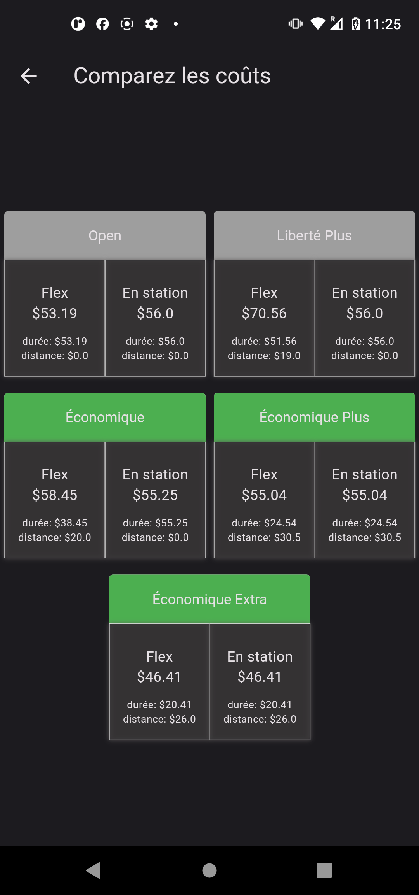
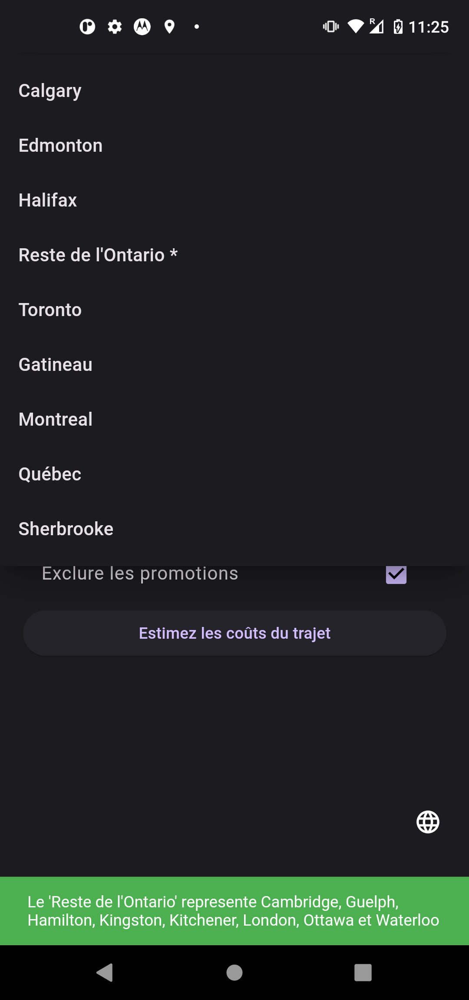

# Communauto Rate Calculator

A simple Flutter app to calculate trip rates for the various Communauto plans.

**This app is not affiliated to - nor endorsed by - Communauto**

### Screenshots

### Getting Started with Flutter

For help getting started with Flutter development, view the
[online documentation](https://docs.flutter.dev/), which offers tutorials,
samples, guidance on mobile development, and a full API reference.
